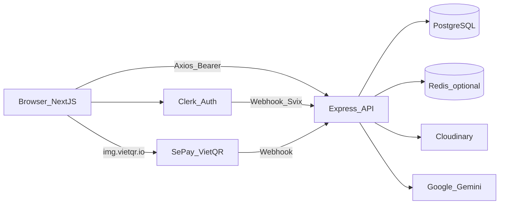
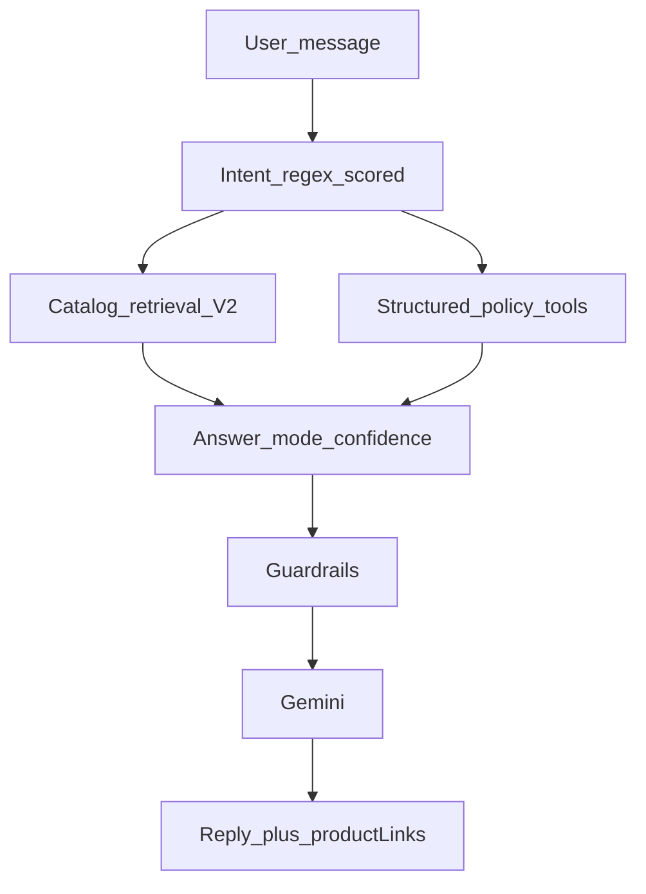

# Tổng hợp chi tiết dự án DGtech

DGtech là **nền tảng e-commerce nội thất / trang trí nhà** (không phải điện tử — một số tài liệu cũ còn lẫn domain). Monorepo gồm storefront + admin (Next.js) và REST API (Express), deploy hướng Render + Postgres hosted (Neon-compatible). Repo: `https://github.com/DHDuong2903/DGtech.git`.

> Tài liệu này thay thế bản tổng hợp cũ (đã gỡ phần RAG/pgvector vì embeddings đã bị remove khỏi backend). Chi tiết AI roadmap xem thêm `README.md`, `AI_CHATBOT_UPGRADES.md`.

---

## 1. Kiến trúc tổng thể



| Lớp | Công nghệ |
|-----|-----------|
| Frontend | Next.js **16**, React **19**, App Router, TypeScript, Tailwind **4**, shadcn/Radix, Zustand, Axios, Three.js + R3F + drei |
| Backend | Node ESM, Express **5**, TypeScript, Sequelize **6**, PostgreSQL |
| Auth | Clerk (frontend UI + `clerkMiddleware` qua `proxy.ts`; backend JWT + webhook) |
| Media | Cloudinary (ảnh + GLB 3D) |
| AI | Gemini (intent-routed, catalog/policy grounded) |
| Payment | COD, chuyển khoản + VietQR, webhook SePay |
| Cache | Redis nếu có `REDIS_URL`, fallback memory Map |
| Deploy | Frontend Render (`dgtech-frontend.onrender.com` trong CORS); backend migrate-on-start |

**Không phải** Turborepo/Nx — hai package độc lập (`frontend/`, `backend/`) + root script mỏng. **Không** Docker / `.env.example` trong repo. ORM là **Sequelize**, không Prisma.

### Cấu trúc thư mục chính

| Path | Vai trò |
|------|---------|
| `frontend/src/app/` | App Router: storefront + admin |
| `frontend/src/components/` | UI public / admin / shared / shadcn |
| `frontend/src/stores/` | Zustand |
| `frontend/src/apis/` | Axios API clients |
| `backend/src/server.ts` | Express entry |
| `backend/src/controllers/` | HTTP handlers |
| `backend/src/services/` | Business logic |
| `backend/src/models/` | Sequelize models |
| `backend/src/middlewares/` | Auth, admin, Gold, upload |
| `backend/src/libs/` | DB, cache, Cloudinary, sync |
| `backend/migrations/` | Sequelize migrations |
| `backend/src/data/vn/` | Tỉnh/phường, zone shipping |

### API surface (`/api/*`)

`users`, `categories`, `products`, `reviews`, `cart`, `orders`, `payments`, `slideshows`, `addresses`, `shipping`, `discount-campaigns`, `bundles`, `vouchers`, `taxs`, `stock-receipts`, `ai`, `showroom`, `rooms`, `webhooks`

---

## 2. Feature — nói qua (core e-commerce chuẩn)

Những phần này “đủ dùng, đầy đủ”, nhưng không phải điểm khác biệt chính:

- **Auth**: đăng ký/đăng nhập Clerk; sync user qua webhook `user.created`; role `admin` / user thường.
- **Catalog**: danh mục, sản phẩm, biến thể, tìm kiếm/lọc/sort/pagination (shop 20/trang, URL sync query).
- **Reviews**, slideshow trang chủ (Embla), dark/light theme, toast Sonner.
- **Giỏ hàng** (Zustand persist + sync API), drawer mini-cart, chọn nhiều / xóa hàng loạt.
- **Địa chỉ VN** (tỉnh/phường từ data tĩnh + API geo), **thuế**, **đơn hàng** (list/detail/hủy), theo dõi trạng thái.
- **Admin CRUD** rộng: products, categories, orders, users, vouchers, campaigns, bundles, shipping, tax, stock-receipts, slideshows, rooms, showroom scenes.
- **UI**: shadcn “new-york”, primary cam ấm (OKLCH), Geist + Fraunces trên home.

### Routes storefront chính

| Route | Mục đích |
|-------|----------|
| `/` | Landing / home sections |
| `/shop`, `/shop/[id]` | Listing + PDP (variants, 3D, bundles, reviews) |
| `/cart`, `/checkout` | Giỏ + thanh toán |
| `/orders`, `/orders/[orderId]` | Đơn hàng |
| `/payment/[orderId]` | VietQR / trạng thái thanh toán |
| `/addresses` | Địa chỉ giao hàng |
| `/membership` | Hạng thành viên |
| `/showroom-3d` | Showroom 3D (Gold) |

---

## 3. Feature lớn — đi sâu

### 3.1 Showroom 3D (điểm nhấn sản phẩm)

**Làm gì:** Gold member vào `/showroom-3d`, chọn scene phòng (GLB), gắn sản phẩm có `model3dUrl` vào **slot** theo category, tint màu biến thể, lưu setup — xem “phòng đã bài trí” trước khi mua.

**Cách làm:**

- Frontend: `frontend/src/components/public/showroom/ShowroomCanvas.tsx` (R3F) load room GLB + product GLB; marker `SLOT_*` / `CAM_*` điều khiển vị trí và camera; OrbitControls; HTML overlay nhãn slot; `frontend/src/lib/colorVariantTint.ts` duyệt mesh đổi màu.
- Admin: upload room GLB (tới **100MB**), map slot → `allowedCategoryId`, preview live (`SceneEditorForm.tsx`).
- Backend: `backend/src/services/showroomService.ts` (~1.5k dòng, SQL nặng); gate `requireGoldTier`; bảng `showroom_scenes`, `showroom_scene_slots`, `showroom_saved_setups`; sanitize: 1 SP/slot, đúng category, không trùng SP.
- PDP/card: preview 3D lazy qua IntersectionObserver khi có model.
- Media: room GLB → Cloudinary `showroom/rooms`; product model → `products/models` (giới hạn ~25MB).

**Mô hình membership:** rank **tính từ lịch sử đơn** (DELIVERED/COMPLETED − penalty hủy); mặc định bronze → silver (~5M) → gold (~20M), admin chỉnh được (`RankSetting`). Showroom chỉ mở khi rank computed = gold.

### 3.2 AI Concierge (Stage 5 — intent-routed business assistant)

**Làm gì:** Widget chat nổi; trả lời dựa trên **catalog thật + policy thật**, không hallucinate domain sai.

**Pipeline:**



**File chính:**

- `backend/src/services/aiChatService.ts` — orchestration
- `aiWebsiteKnowledgeService.ts` — intent + knowledge blocks
- `aiCatalogContextService.ts` — catalog retrieval V2 + cache
- `aiPolicyStructuredContextService.ts` — policy snapshots
- `aiStructuredContextService.ts` — answer mode / confidence
- `aiConversationService.ts` — persistence

**Chi tiết:**

- Intent: `product_catalog`, `shipping_policy`, `payment_policy`, `voucher_policy`, `membership_policy` (gồm keyword showroom/3D), `promotion_products`, `order_support`, `store_capability`, `general_support`.
- Policy intents thuần → **không** nhét catalog (trừ khi force promo).
- History: tối đa **12** turn; user auth lưu conversation DB (max **5** hội thoại/user).
- Guardrails: chặn hỏi admin nội bộ; không bịa hoàn/hủy; clarify khi confidence thấp; map quota Gemini → message tiếng Việt.
- **Không còn RAG/pgvector:** migration đã remove embeddings; retrieval hiện tại là catalog/policy structured + intent routing (không semantic vector search).

Roadmap maturity Stage 0→5: xem `README.md`.

### 3.3 Thanh toán Việt Nam (COD + VietQR + SePay)

| Phương thức | Hành vi |
|-------------|---------|
| COD | Order → `PROCESSING`, trừ kho ngay |
| BANK_TRANSFER | Order `PENDING`, Payment PENDING, hiện QR VietQR; **kho hold đến khi paid** |
| SePay webhook | Parse mã `DH` + 8 ký tự orderId; khớp số tiền; idempotent complete → PAID + trừ kho + `PROCESSING` |

Nội dung CK: `generateTransactionContent`; QR qua `img.vietqr.io`. Webhook: `POST /api/webhooks/sepay`.

File: `paymentService.ts`, `paymentHelper.js`, `webhookService.ts`, `orderPaymentCompletionService.js`.

### 3.4 Pricing phức tạp: Campaign + Bundle + Voucher

- **Discount campaigns:** không sửa giá DB; overlay giá thắng (priority ASC); mode `price_list` hoặc `price_rule` (PERCENT/FIXED); scope product/category/all; có `targetTiers`. Cache campaign active.
- **Bundles:** giảm giá combo độc lập campaign; cart `itemType` BUNDLE; `maxPerUser` qua `BundlePurchase`; stock hiệu dụng theo dòng bundle.
- **Vouchers:** PERCENT / FIXED / FREE_SHIPPING; audience ALL / TIER_USERS (hạng lấy qua `getStorefrontUserTier` = **cùng rank computed** với showroom/membership; cột `users.tier` không còn dùng cho storefront).

### 3.5 Checkout / inventory / shipping

**Checkout:** địa chỉ → cart đã chọn → enrich campaign → validate stock & bundle caps → subtotal → shipping quote → tax snapshot → revalidate voucher → `total = taxTotal - voucherDiscount` → explode bundle lines → trừ kho (COD) hoặc hold (CK) → clear cart đã chọn + ghi redemption.

**Trạng thái đơn:** `PENDING → PROCESSING → SHIPPED → DELIVERED → COMPLETED`; hủy từ PENDING/PROCESSING; unpaid bank transfer không đẩy fulfillment; hủy hoàn stock nếu đã allocate.

**Inventory:** phiếu nhập DRAFT → POSTED (row-lock, tăng stock, `InventoryMovement` RECEIPT); bán giảm stock; invalidate cache storefront khi post.

**Shipping VN:** `provinceCode` → zone (`warehouse`, `north_near`, `north_far`, `central`, `south`) → method standard/express → flat rate; free-ship threshold; display `separate` | `included`. Data: `backend/src/data/vn/`.

---

## 4. Tối ưu & xử lý “ẩn” trong hệ thống

| Khu vực | Cơ chế |
|---------|--------|
| HTTP | `compression()`, CORS `maxAge` 24h, timeout upload dài (120s) cho GLB |
| DB | Pool env `DB_POOL_*`, SSL auto Neon/prod, `withDbRetry`, 503 khi DB transient |
| Cache | Fresh TTL + **stale-while-error**; version bump `storefront-products` khi product/campaign/stock đổi; cache AI catalog + policy snapshots |
| Frontend media | AVIF/WebP; `optimizePackageImports` (lucide, clerk, date-fns); `next/dynamic` home sections + AI widget `ssr:false` |
| 3D perf | Lazy mount GLB trên card (IntersectionObserver); `useGLTF.preload`; tách canvas nặng khỏi SSR |
| Auth race | Clerk token gắn sớm trên axios để tránh mismatch giá/auth request đầu |
| Client cache | Categories/rooms TTL ~5 phút trong Zustand; cart persist tránh flash rỗng |
| Payments | Idempotent complete bank transfer; stock timing khác nhau COD vs CK (tránh oversell khi unpaid) |

---

## 5. Domain dữ liệu (rút gọn)

```
Users (Clerk) → Addresses, Cart/Items, Orders/Items, Payments
Products/Variants (+ model3dUrl) ← Categories
Campaigns / Bundles / Vouchers chồng lên giá & checkout
Shipping zones/rates + Tax + Rank settings
StockReceipts → InventoryMovements
ShowroomScenes → Slots → SavedSetups (Gold)
AiConversations → Messages
```

### Models Sequelize (tóm tắt)

User, UserAddress, Category, Product, ProductVariant, Review, Cart, CartItem, Order, OrderItem, Payment, Bundle, BundleItem, BundlePurchase, Voucher, UserVoucherRedemption, DiscountCampaign (+ liên kết product/category/variant price), ShippingZone/Method/Rate/ProvinceZone/Setting, TaxSetting, RankSetting, StockReceipt, StockReceiptLine, InventoryMovement, AiConversation, AiConversationMessage, Slideshow, ShowroomScene, ShowroomSceneSlot, Room. Bảng SQL `showroom_saved_setups` (saved layouts). `ProductShowroomOverride` tồn tại schema nhưng **không dùng** runtime.

Associations: `backend/src/models/associationsModel.ts`.

---

## 6. Giá trị thực tế — có “đóng góp” gì không?

### Thực trạng thị trường

- **Nội thất VN:** ~1,5 tỷ USD (2024, IMARC) → hướng ~2,3 tỷ USD năm 2033 (CAGR ~4,7%); e-commerce là kênh tăng nhanh (Mordor ~13% CAGR online tới 2031).
- **Online furniture VN:** doanh thu online ~**1,85 tỷ USD (2025)** (ECDB, trích Báo Đầu Tư), tăng ~10–15% YoY; Shopee đang mở vận chuyển/lắp đặt hàng cồng kềnh — tín hiệu hành vi mua sofa/giường online đang chín.
- **Pain point cố hữu:** mua nội thất online không “sờ / ướm không gian” → tỷ lệ trả hàng ngành nội thất thường **15–30%+**; lý do chính: sai kích thước, sai màu, không hợp style (~75% lý do trả liên quan visualization).
- **Bằng chứng quốc tế:** IKEA Place / Wayfair View-in-Room — AR/3D gắn với giảm return ~20–43%, tăng conversion / AOV (case study ngành; không phải số liệu nội bộ DGtech).
- **VN đã có đối thủ chuyên sâu:** Haizz AI, Marvy (WebAR), VR Plus — thị trường **đã công nhận** nhu cầu visualization.

### Vấn đề DGtech nhắm tới

| Pain | Cách DGtech trả lời |
|------|---------------------|
| Không hình dung đồ trong phòng | Showroom 3D slot + tint màu + lưu layout |
| Hỏi CSKH lặp / AI bịa catalog | Intent-routed Gemini grounded DB + policy |
| Thanh toán VN thực tế | VietQR + SePay webhook, COD |
| Vận hành shop thật | Admin đủ: kho nhập, campaign, bundle, voucher, shipping theo vùng VN |
| Loyalty / upsell trải nghiệm premium | Rank → Gold unlock showroom |

### Đánh giá thẳng (strength / gap)

**Đóng góp thực — MVP / portfolio nâng cao, đúng hướng ngành:**

- Không chỉ “CRUD shop”: ghép **commerce VN + 3D configurator + AI grounded + membership gate**.
- Kiến trúc AI (intent → retrieval → guardrail → LLM) là pattern production.
- Showroom giải pain “fit & color”; hướng **room template + slot** (thực dụng hơn full room scan cho capstone/CV).

**Chưa sẵn sàng thay Haizz/IKEA:**

- Chưa AR-in-your-room; phụ thuộc scene admin.
- ~~`User.tier` (voucher) vs rank computed (showroom) lệch~~ — đã fix Option A (`getStorefrontUserTier` → `getMyRank`).
- Guest AI persistence lệch giữa service và route; RAG đã bỏ.
- Thiếu Docker/env template; chưa có A/B nội bộ (conversion, return).

**Kết luận:** Đô thị hóa + e-commerce hàng cồng kềnh tăng → nhu cầu mua nội thất online tăng, niềm tin hình ảnh thấp. DGtech xây **cầu nối tin cậy** (3D trong ngữ cảnh phòng + AI biết hàng thật + thanh toán/vận hành VN). Vấn đề thật; mức hiện tại = **prototype thương mại có chiều sâu kỹ thuật**, đủ làm case study / nền tảng mở rộng, chưa validate doanh thu.

Xem thêm: `DGTECH_CV_HIGHLIGHT.md`, `DGTECH_ROADMAP.md`.

---

## 7. Bản đồ file quan trọng

| Chủ đề | Path |
|--------|------|
| Tổng quan | `README.md`, `TONG_HOP_CODE_DGTECH.md` |
| AI | `backend/src/services/aiChatService.ts`, `aiWebsiteKnowledgeService.ts`, `aiCatalogContextService.ts`, `AI_CHATBOT_*.md` |
| Showroom FE | `frontend/src/app/showroom-3d/page.tsx`, `ShowroomCanvas.tsx`, `GlbPreviewViewer.tsx` |
| Showroom BE | `backend/src/services/showroomService.ts`, `requireGoldTier.ts` |
| Payment/order | `paymentService.ts`, `orderService.ts`, `webhookService.ts` |
| Cache/DB | `backend/src/libs/cache.ts`, `backend/src/libs/db.js` |
| Highlight / roadmap | `DGTECH_CV_HIGHLIGHT.md`, `DGTECH_ROADMAP.md` |

---

## 8. Env quan trọng (không có `.env.example` trong repo)

**Backend:** `DATABASE_URL`, `PORT`, `NODE_ENV`, `CLERK_SECRET_KEY`, `CLERK_WEBHOOK_SECRET`, `CLOUDINARY_*`, `SEPAY_*`, `GEMINI_API_KEY`, `GEMINI_MODEL`, optional `REDIS_URL`, `DB_POOL_*`.

**Frontend:** `NEXT_PUBLIC_CLERK_PUBLISHABLE_KEY`, `CLERK_SECRET_KEY`, `NEXT_PUBLIC_API_URL`.
